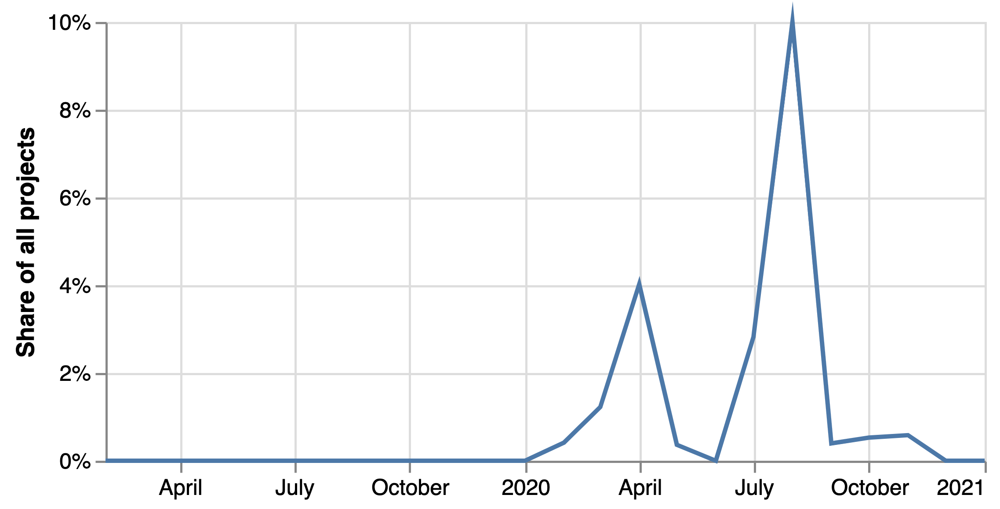
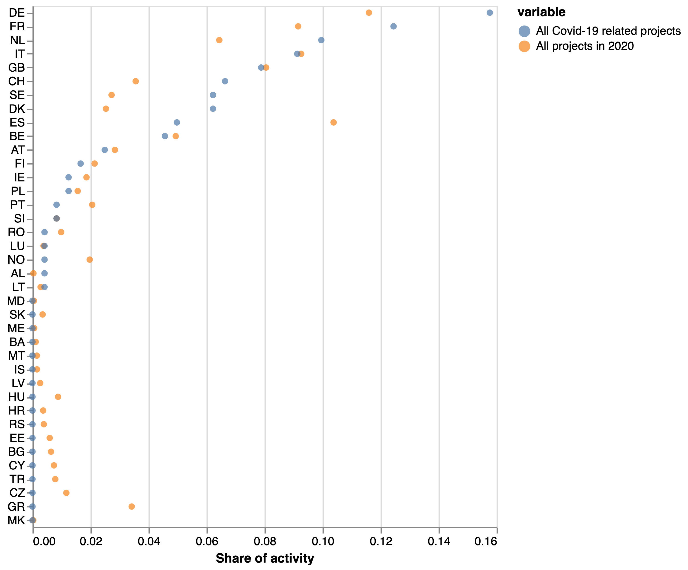
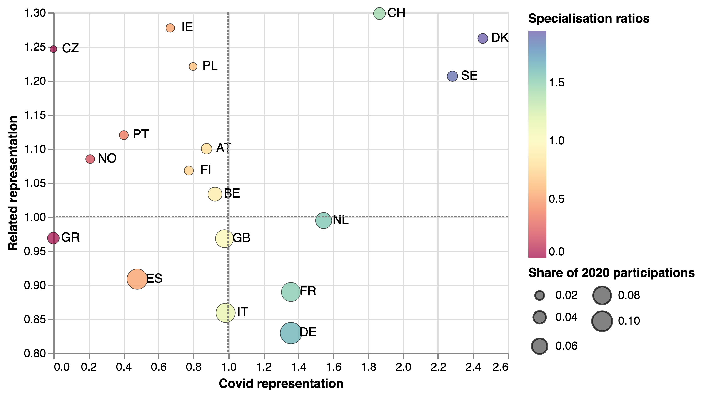
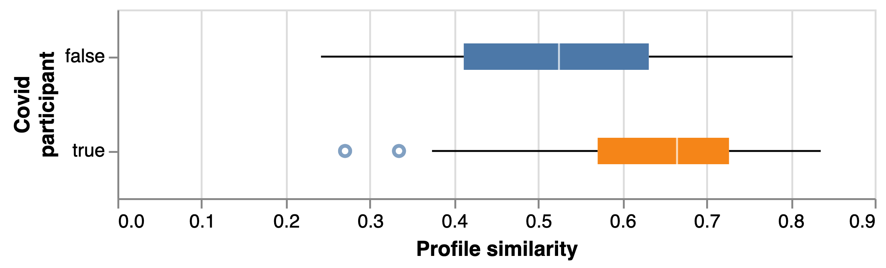
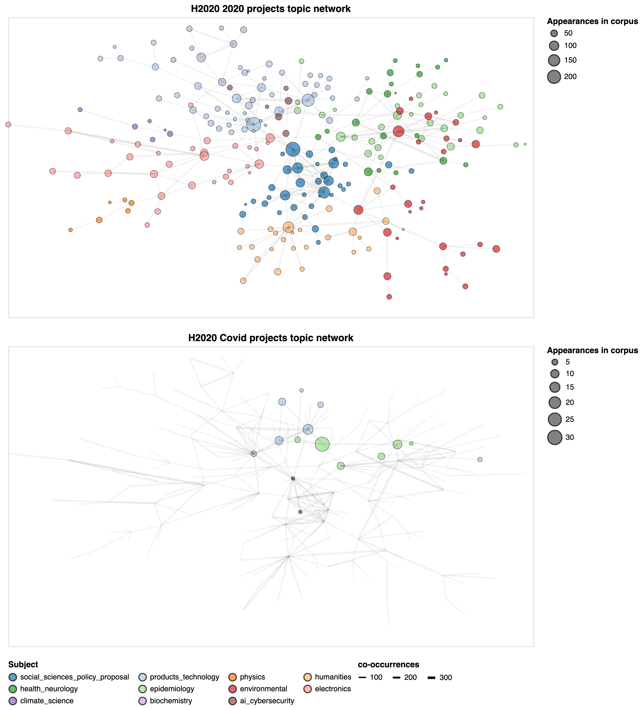

# 1. Introduction

Research and innovation funders across the world have mounted an unprecedented response to the Covid-19 pandemic. Ensuring that this response is effective and impactful requires new Relevant, Inclusive, Trusted and Open indicators providing a deep understanding of its composition and direction. In this note we use data science methods to develop such indicators in relation to the open CORDIS database of R&D activities funded by the Horizon 2020 Framework Programme. As part of this, we: 

* Analyse national participation in Covid-19 projects taking into account related research capabilities
* Analyse organisational participation in Covid-19 projects taking into account related research capabilities
* Compare the thematic composition of Covid-19 projects with the wider corpus of EU-funded research
* Measure project eccentricity (a proxy of novelty or uniqueness) and its connection with the profiles of participants in Covid-related R&D activities in the EU

# 2. Data sources

Our main data source is CORDIS, an open database with information about framework programme funded projects. CORDIS includes project descriptions, starting dates, level of funding and participations and their locations. 

# 3. Findings

### Covid-19 related research

We focus our analysis on just under thirty thousand projects started since 2015, and identify Covid-19 projects by searching their objectives (project description) for Covid-19 related terms such as `covid`, `coronavirus`, `sars-ncov2` etc. This yields 46 projects with a total budget of €222.1 million. 

We present some random examples below:

* Three Rapid Diagnostic tests (Point-of-Care) for COVID-19 CoronaThree Rapid Diagnostic tests (Point-of-Care) for Coronavirus, improving epidemic preparedness, public health and socio-economic benefits

* Rapid therapy development through Open nCoronavirus Vaccine Platform

* 3D image-based search engine and triaging software for lung CTs to improve radiology workflows

* An AI assistant using proprietary unsupervised algorithm(s) to automatically analyse large volumes of complex data to detect anomalies and recognize patterns in real time

* Rapid diagnostic for bacterial SEPSIS and AMR urgently needed for ICU patients in COVID-19-like epidemics

* Unravelling species barriers of coronaviruses

* Virus discovery and epidemic tracing from high throughput metagenomic sequencing

* A Whole New Category of Vehicle: The ONO Pedal Assisted Transporter

* COVID-19-Outbreak Response combining E-health, Serolomics, Modelling, Artificial Intelligence and Implementation Research

* AI software for the automated detection of covid-19 infection on chest CT

This amounts to 2.6% of all funding for projects starting in 2020. We note that this does not include live projects (such as EURITO) that have "pivoted" to focus on Covid-19 but do not mention such changes in their original project objectives. As such, our analysis only reflects new projects started in response to the pandemic.  

Out of our 46 projects, only two started before 2020. Figure 1 below presents the share of projects started monthly accounted by our group of Covid-19 related projects. It shows two spikes of activity around April and July 2020. Given the small number of projects involved and their relative proximity in time we will not undertake a longitudinal analysis of their evolution in the rest of this note.

### National representation

The 46 Covid-projects involve 250 participants from 28 countries. On average, Covid-19 projects involve a larger number of participants (5.12 versus 4.43 for non-Covid-19 projects started in 2020) although this is in part  driven by a small number of research networks and emergency response groups involving a large number of partners.

In Figure 2 we present the share of participations in Covid-19 projects accounted for organisations in different EU member states compared to their overall share of participation in projects started in 2020. It shows that some countries such as Germany, France, the Netherlands, Sweden, Denmark and Switzerland are overrepresented in their participation in Covid-19 projects while other countries such as Spain, Norway and perhaps most notably Greece (with no participations in Covid-19 projects) are underrepresented.

These differences could be explained by the presence of different research capabilities in various countries: if for example a country has a strong specialisation in vaccine development or analysis of Computer Tomography (CT) scans, then this might enable it to develop projects to tackle the pandemic where such techniques are relevant. 

In order to explore this idea, we train a Correlation Explanation topic model on our corpus of project descriptions going back to 2015. This yields a set of topics (collections of terms that tend to appear in the same project descriptions) and weights indicating their presence in a project. Having done this, we measure the (cosine) similarity between the resulting topics and a 'Covid-19' label we assign to those projects we identified in this category.

Table 1 presents the top ten most similar topics to our Covid-19 label. As we see, they are topics primarily related to biomedical subjects (topic 0, 2, 4, 6) but we also find some related to smartphone apps (topic 5), software (topic 8) and other devices (topic 9). 

| n   | topic                                             |   similarity |
|---:|:--------------------------------------------------|-------------:|
|  0 | patients clinical patient treatment therapy       |    0.0675263 |
|  1 | people professionals ~control lives personal      |    0.0551284 |
|  2 | drug drugs bacteria immune bacterial              |    0.0548009 |
|  3 | cause due_to loss worldwide damage                |    0.0519648 |
|  4 | health risk interventions prevention intervention |    0.0495095 |
|  5 | automatically need app smartphone growing         |    0.0466478 |
|  6 | disease diseases therapeutic cancer disorders     |    0.0461861 |
|  7 | validated validate available trials validating    |    0.0388458 |
|  8 | solution software system cost hardware            |    0.0367869 |
|  9 | devices device fast portable revolutionary        |    0.0328745 |

Table 1: Top ten topics by similarity to Covid-19 projects.

Having calculated the similarity / relatedness between various topics and the techniques and methods deployed in the Covid-19 response, we then estimate the level of research activity of different countries in projects in various topics weighted by their similarity to Covid-19 _before 2020_ in order to establish the extent to which they had relevant capabilities before the arrival of the pandemic.

Figure 3 compares the level of representation of a country in Covid-19 projects (share of Covid-19 participations over the share of all 2020 participations) with its share of related participation pre-2020 (share of projects weighted by their similarity to Covid-19 projects compared to pre-2020 unweighted share of all projects). The colour of the bubbles represents the ratio between both values, with blue colours indicating over-specialisation in Covid given previous specialisation in similar topics, and red colours the opposite.

* Countries in the top-right quadrant (Switzerland, Sweden and Denmark) were relatively specialised in research topics that have proven relevant for the battle against the pandemic, and are also (perhaps unsurprisingly) overrepresented among Covid-19 projects. 
* Countries in the bottom-left quadrant such as Greece and Spain were relatively less specialised in subjects related to Covid-19 and tend to be underrepresented in terms of Covid-19 participations. 
* Countries in the top-left quadrant had strong Covid-19 related levels of activity but low levels of participation in Covid-19 research in 2020. 
* Countries in the bottom-right quadrant such as Germany and France had lower levels of representation in Covid-19 related research activities before the pandemic but are strongly represented in the response to the pandemic.

Understanding the drivers and barriers for different countries' level of participation in the response to Covid-19 could yield policy-relevant insights. In particular, it looks like relevant capabilities in Eastern European countries such as the Czech Republic and Poland, as well as Ireland, may have been under-exploited. Having said this, we note that many of these countries have a smaller research footprint, perhaps reducing their capacity to reorient their research activities towards Covid-19 when the pandemic arrived (the opposite is perhaps true for countries with large research and innovation systems such as Germany and France).

### Organisational activity

As a next step, we zoom from highly aggregated (national) measures of participation in Covid-19 to consider the organisation-level picture. In total, we find 205 unique organisations participating in Covid-19-related projects. We display the top 20 by number of participations in table 2.

| Organisation                                                                                                                 | Country   |   Covid participations |
|:---------------------------------------------------------------------------------------------------------------------|:---------------|-----------------------:|
| Katholieke Universiteit Leuven                                                                                       | BE             |                      5 |
| Academisch Ziekenhuis Leiden                                                                                         | NL             |                      4 |
| Institut National De La Sante Et De La Recherche Medicale                                                            | FR             |                      4 |
| The Chancellor, Masters And Scholars Of The University Of Oxford                                                     | GB             |                      3 |
| Istituto Nazionale Per Le Malattie Infettive Lazzaro Spallanzani-istituto Di Ricovero E Cura A Carattere Scientifico | IT             |                      3 |
| Erasmus Universitair Medisch Centrum Rotterdam                                                                       | NL             |                      3 |
| Universiteit Utrecht                                                                                                 | NL             |                      3 |
| Rijksinstituut Voor Volksgezondheid En Milieu                                                                        | NL             |                      3 |
| Karolinska Institutet                                                                                                | SE             |                      3 |
| Universite D'aix Marseille                                                                                           | FR             |                      3 |
| Eidgenoessisches Departement Des Innern                                                                              | CH             |                      3 |
| Helmholtz-zentrum Fur Infektionsforschung Gmbh                                                                       | DE             |                      3 |
| Charite - Universitaetsmedizin Berlin                                                                                | DE             |                      2 |
| Institut Pasteur                                                                                                     | FR             |                      2 |
| Helmholtz Zentrum Muenchen Deutsches Forschungszentrum Fuer Gesundheit Und Umwelt Gmbh                               | DE             |                      2 |
| Universita Vita-salute San Raffaele                                                                                  | IT             |                      2 |
| Commissariat A L Energie Atomique Et Aux Energies Alternatives                                                       | FR             |                      2 |
| Universitaet Ulm                                                                                                     | DE             |                      2 |
| Inserm - Transfert Sa                                                                                                | FR             |                      2 |
| Universitat Zu Lubeck                                                                                                | DE             |                      2 |

Table 2: Top twenty participants in Covid-19 related projects

In a similar vein to our national analysis before, we are interested in understanding whether an organisation's participation in Covid-19 projects reflects its research capabilities before Covid-19 (our prior is that it will). 

In order to address this question, we summarise an organisation's pre-pandemic research capabilities by averaging the topic weights for the projects it participated on before 2020 and measuring its cosine similarity to the averaged topic weights for all Covid-19 projects in the data: a higher degree of similarity would suggest that an organisation previously worked in areas thematically similar to the Covid-19 corpus. We will compare these similarities with a random sample of organisations that have not participated in Covid-19 projects. 

As Figure 3 shows, organisations participating in Covid-19 projects had, on average, worked on thematically similar research projects before 2020. We find that their average similarity to the Covid-19 programme is 25% higher than in the random sample of non-Covid-19 participants (this difference is statistically significant at the 1% level). 

Having said this, we note some spread in the distributions, with some participant organisations displaying low level of thematic similarity to the Covid-19 programme, and some non-participating ones displaying high levels of thematic similarity (see box for some examples). We speculate that the first group might be bringing new capabilities and technologies to the fight against Covid-19 (we consider this further in our analysis of 'research eccentricity' below). 

|Type                    | top 10 organisations               |
|----------------------- |-------------------------------------|
|Low similarity participant organisations | Dompe Farmaceutici Spa, International Institute Of Molecular And Cell Biology, Bundesministerium Der Verteidigung, Aicuris Anti-infective Cures Gmbh, Content Flow Gmbh, Hpnow Aps, Elettra - Sincrotrone Trieste Scpa, Tretbox Gmbh, Xsensio Sa, Sun Yat-sen University, Fondazione Icons, Institut Pasteur Of Shanghai, Chinese Academy Of Sciences, Eyefree Assisting Communication Ltd, Cobra Biopharma Matfors Ab, Biosistemika, Raziskave In Razvoj Doo|
|High similarity non-participant organisations| Medizinische Universitat Innsbruck, London School Of Hygiene And Tropical Medicine Royal Charter, Genome Research Limited, Universitaetsklinikum Bonn, Fundacio Institut De Recerca Contra La Leucemia Josep Carreras, Klinikum Rechts Der Isar Der Technischen Universitat Munchen, Istituto Superiore Di Sanita, The University Of Sheffield, The Provost, Fellows, Foundation Scholars & The Other Members Of Board Of The College Of The Holy & Undivided Trinity Of Queen Elizabeth Near Dublin, Mosaiques Diagnostics Gmbh, Merck Sharp & Dohme Corp, University College London, University College Dublin, National University Of Ireland, Dublin, Alzheimer Europe, Universite De Geneve|

Table 3: Illustrative organisations with unexpected mixes of similarity / participation in Covid-19 projects

Understanding why, despite the presence of relevant capabilities, the second group is not participating in Covid-19 related projects might yield policy-relevant implications. This pool of company also present a promising group of organisations that could be targeted in order to close the Covid-19 participation gap that we identified for some countries.

## Topical composition

We explore further the topical composition of the Covid-19 using top-SBM, another topic modelling algorithm. We train top-SBM on the corpus of H2020 projects started in 2020, which include 49 Covid-19 projects. 

We use co-occurrences between topics in research projects to build a network where the nodes are topics and the edges are the number of co-occurrences so that nodes closer in the network tend to appear in the same project descriptions. We use community detection methods to decompose this network into a smaller number of subject-areas that we label manually. We present the results in Figure 4, where the top panel displays the topic network for all H2020 projects started in 2020 and the bottom panel the topic network for Covid-19 projects.

Putting both graphs side by side helps us to see that Covid-19 projects tend to be focused on a small number of topics in the areas of epidemiology and product and technology. We see very limited activity around social sciences, policy and arts and humanities despite the importance that some of these disciplines may present for understanding and mitigating the impacts of the pandemic.

## Project eccentricity

We conclude by studying the eccentricity of Covid-19 projects, which we define as their average distance from existing clusters in the programme of Covid-19 research. We see this as a proxy for project distinctiveness, uniqueness and - perhaps - novelty. 

The way we measure it is by:

1. Grouping all Covid-19 projects into K-clusters based on the distance between their topic vectors using the K-means algorithm and a range of values of K between 1 and 15 (this has the goal of increasing the robustness of our results to the choice of cluster number), 
2. For each project and cluster fit, calculating its median distance to the centroids of the estimated clusters
3. Averaging these scores over all clusters

Projects with high values in this metric tend to be far away from the clusters we have identified, suggesting that they are different from the sub-populations of projects in the data. Projects with low values are easier to classify into existing clusters of Covid-19 research, making them in a sense less distinctive. 

Table 4 displays examples of the most and least eccentric projects in the data based on this approach. An initial assessment suggests that projects focusing on basic research and vaccine development are more distinctive, while projects to develop devices, solutions and technologies for the healthcare system tend to be less distinctive. 

| Project category          | Top examples                                               |
|:------------------|:------------------------------------------|
| High eccentricity | Canonical and non-canonical secretory mechanisms of cytokines in bat and human cell cultures in response to coronavirus infection: a comparative study, Translational approaches to disease modifying therapy of type 1 diabetes - HARVESTing the fruits of INNODIA, Revolutionary vaccines to prevent pandemic and seasonal outbreaks of respiratory viral infections: The best-in-class UNIVERSAL multi-season influenza vaccine, Prevention of SARS-CoV-2 infection through development and clinical testing of a novel Virus Like Particle (VLP) vaccine, Secure, safe, sustainable and affordable on-site generation of Hydrogen Peroxide                                                                                                                                          |
| Low eccentricity  | Harmless Respiration for Intensive Care Patients decreasing mortality and shortening stays including COVID-19 patients, Increasing Survival of Patients with Severe SARS-CoV-2 Infection and/or Multi Organ Failure by up to 30% with ADVOS - ADVanced Organ Support, Optimal use of hospital resources and intervention using suPAR for improving prognosis and care for patients with COVID-19, COVID-19 Telemedicine an infectious disease management tool for governments all over Europe that will reduce casualties from COVID-19 as well as prepare governments for the next wave of epidemics., COVID-19 ICU-CARE A ground-breaking ICU bed-side COVID-19 trachea flushing system that can cut healthcare costs and reduce COVID-19 spread between ICU patients and staff |

Table 4: Highest and lowest eccentricity Covid-19 projects

Interestingly, and perhaps contrary to what we would have expected, we do not find any correlation between the degree of eccentricity in a project and an organisation's relatedness to the Covid-19 programme as calculated above. One potential explanation is that some of the new entrants in the 'Covid-19 research system' might be focusing on incremental innovations, while some established organisations with accumulated expertise work on cutting-edge and disruptive technologies. This observation is in line with emerging findings from the analysis of 'racing' in the development of technologies to fight Covid-19 (see [an example here](https://papers.ssrn.com/sol3/papers.cfm?abstract_id=3587973)).

# 4.Conclusion and next steps

This research note illustrates the potential for using data science methods to generate Relevant, Inclusive, Trusted and Open indicators about EU-funded research activities to tackle Covid-19 going beyond measures of the volume of activity to also encapsulate the types of organisations involved, the range of themes being explored and the distinctiveness of the ideas being developed. 

The initial analysis that we have explored here could be expanded in various directions such as:

* Exploring in further detail the reasons for national and organisational differences in levels of Covid-19 participation
* Comparing the programme of Covid-19 research funded through Horizon 2020 with the activities of other actors such as the US National Institute for Health (NIH), whose data is available from the NIH Reporter Database, or the [global Covid-19 research project tracker](https://www.ukcdr.org.uk/covid-circle/covid-19-research-project-tracker/) maintained by the UK Collaborative on Development Research
* Considering additional dimensions of novelty, diversity and disciplinary crossover in the corpus of Covid-19 projects, and establishing whether these measures have been historically associated with higher levels of research impact
* Enriching the data with additional information from the Commission about ongoing research projects that have pivoted towards Covid-19 in order to gain a more comprehensive understanding of the portfolio of Horizon R&D activities to tackle the pandemic 
